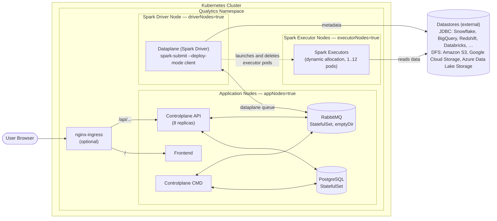

## What is Qualytics?

Qualytics is a closed-source container-native platform for assessing, monitoring, and facilitating enterprise data quality. Learn more [about our product and capabilities here](https://qualytics.ai/product/).

## What is in this chart?

This chart will deploy a single-tenant instance of the qualytics platform to a [CNCF compliant](https://www.cncf.io/certification/software-conformance/) kubernetes control plane.

### Architecture



A Qualytics deployment is split into a **Controlplane**, a **Dataplane**, and the **Datastores** it monitors:

- **Controlplane** — the API and CMD services plus the Frontend UI, all running on Application Nodes (`appNodes=true`). The API serves user requests and orchestrates work; CMD is the background processor that schedules and tracks operations. PostgreSQL holds platform state and RabbitMQ is the message broker between the Controlplane and the Dataplane.
- **Dataplane** — a Spark application: a single driver pod (`driverNodes=true`) that runs `spark-submit` in client mode, plus executor pods (`executorNodes=true`) the driver creates and reaps dynamically based on workload (`dataplane.dynamicAllocation.minExecutors..maxExecutors`, default `1..12`).
- **Datastores** — the external systems Qualytics is profiling and scanning. Two connector families are supported: **JDBC** (Snowflake, BigQuery, Redshift, Databricks, PostgreSQL, Oracle, Microsoft SQL Server, …) and **DFS** (Amazon S3, Google Cloud Storage, Azure Data Lake Storage). The driver opens metadata connections; the executors do the parallel data reads.

Datastores are configured in the Qualytics UI after deployment. See the user guide's [Source Datastores Overview](https://userguide.qualytics.io/source-datastore/overview/) for the full connector list.

## Prerequisites

Before deploying Qualytics, ensure you have:

- A Kubernetes cluster (recommended version 1.30+)
- `kubectl` configured to access your cluster
- `helm` CLI installed (recommended version 3.12+)
- A Qualytics-issued image registry token and deployment identifier
- Authentication configuration — either OIDC credentials from your IdP (recommended) or Auth0 credentials from your Qualytics account manager

## How should I use this chart?

Work with your Qualytics account manager to receive the required installation credentials through a secure channel. If you don't yet have an account manager, [contact Qualytics](mailto:hello@qualytics.ai).

### 1. Create a CNCF compliant cluster

Qualytics fully supports kubernetes clusters hosted in AWS, GCP, and Azure as well as any CNCF-compliant control plane.

> **Terraform Templates Available**: We provide ready-to-use Terraform templates for provisioning Kubernetes clusters on [AWS (EKS)](./terraform/aws), [GCP (GKE)](./terraform/gcp), and [Azure (AKS)](./terraform/azure). See the [`/terraform`](./terraform) directory for details.

#### Infrastructure Flexibility

Qualytics is designed to be flexible and can run on virtually any Kubernetes infrastructure. The platform automatically adapts to available resources, making it compatible with a wide range of cluster configurations. The infrastructure requirements scale based on the volume of data to be processed—smaller datasets can run on minimal resources, while larger data volumes benefit from more powerful configurations.

#### Node Configuration

The architecture above assumes three dedicated node groups (`appNodes`, `driverNodes`, `executorNodes`); for production data volumes we recommend keeping them separate with autoscaling enabled. The setup is flexible if that's overkill for your environment:
- **Combined Spark nodes**: Merge driver and executor labels into a single `sparkNodes=true` label if your node group has sufficient resources for both.
- **No node selectors**: Run on any available cluster nodes without targeting specific groups (disable node selectors in values.yaml).
- **Single node**: For development or small workloads, the entire platform can run on a single appropriately-sized node.

#### Suggested Instance Types

The table below shows **suggested** instance types for a standard **Medium-tier** production deployment, suitable for most workloads up to 10 TB of data under management.

|          |          Application Nodes          |               Spark Driver Nodes                |               Spark Executor Nodes               |
|----------|:-----------------------------------:|:-----------------------------------------------:|:------------------------------------------------:|
| Label    | appNodes=true                       | driverNodes=true                                | executorNodes=true                               |
| Scaling  | Autoscaling (1 node on-demand)      | Autoscaling (1 node on-demand)                  | Autoscaling (1 - 12 nodes spot)                  |
| EKS      | m8g.2xlarge (8 vCPUs, 32 GB)        | r8g.2xlarge (8 vCPUs, 64 GB)                    | r8gd.2xlarge (8 vCPUs, 64 GB, 474 GB SSD)        |
| GKE      | n4-standard-8 (8 vCPUs, 32 GB)      | n4-highmem-8 (8 vCPUs, 64 GB)                   | n2-highmem-8 + Local SSD (8 vCPUs, 64 GB)        |
| AKS      | Standard_D8s_v6 (8 vCPUs, 32 GB)    | Standard_E8s_v6 (8 vCPUs, 64 GB)                | Standard_E8ds_v5 (8 vCPUs, 64 GB, 300 GB SSD)    |

For deployments with different data volumes, the [Cluster Sizing Guide](./docs/cluster-sizing.md) covers all six tiers (Small through 4X-Large), on-premises bare-metal specifications, cloud instance types for EKS/GKE/AKS, and Helm configurations. Contact your [Qualytics account manager](mailto:hello@qualytics.ai) for sizing guidance.


#### Qualytics-issued installation credentials

Obtain these two credentials before installing or upgrading Qualytics:

| Credential | Purpose |
|---|---|
| Image registry token | Pulls the private Qualytics container images from Docker Hub. |
| Deployment identifier | Identifies one Qualytics installation. Every deployment requires its own value. |

The deployment identifier is separate from the platform license requested after installation. Treat both credentials and your populated `values.yaml` as confidential.

#### Docker registry secret

Create the image pull Secret with the registry token provided by Qualytics. The prompt keeps the token out of your shell history.

```bash
kubectl create namespace qualytics
read -rsp "Qualytics registry token: " QUALYTICS_REGISTRY_TOKEN && echo
kubectl create secret docker-registry regcred \
  --namespace qualytics \
  --docker-username qualyticsai \
  --docker-password "$QUALYTICS_REGISTRY_TOKEN"
unset QUALYTICS_REGISTRY_TOKEN
```

> [!IMPORTANT]
> This connects the cluster to the private Qualytics repositories on Docker Hub. If policy requires an internal registry, follow the secure mirroring instructions in [Qualytics Docker Images](./docs/docker-images.md), then update the image URLs in `values.yaml`.


### 2. Create your configuration file

For a quick start, copy the simplified template configuration:

```bash
cp template.values.yaml values.yaml
chmod 600 values.yaml
```

The root `values.yaml` is ignored by Git. Do not commit or share a populated values file; GitOps users should store sensitive values with their organization's encrypted secret-management workflow.

Update these required settings:

1. **Deployment identifier** — paste the value provided by Qualytics exactly as received. Do not base64-encode it or reuse it for another deployment.

   ```yaml
   secrets:
     deployment:
       identifier: "<provided by Qualytics>"
   ```

   > [!IMPORTANT]
   > Existing installations must add this value before upgrading to a chart release that requires deployment identifiers. If it is missing, Helm stops during rendering before changing Kubernetes resources. Use the chart version provided by Qualytics; `main` may include unreleased changes.

2. **DNS Record** (provided by Qualytics or managed by customer):
   ```yaml
   global:
     dnsRecord: "your-company.qualytics.io"  # or your custom domain
   ```

3. **Authentication** — choose one of the following:

   **Option A: OIDC — Direct IdP Integration (Recommended)**

   Set `global.authType` to `OIDC` and configure your Identity Provider credentials. Register Qualytics as a Web Application in your IdP with `https://<your-domain>/api/callback` as the redirect URI, Authorization Code grant type, and at minimum `openid` scope.

   ```yaml
   global:
     authType: "OIDC"

   secrets:
     oidc:
       oidc_scopes: "openid,email,profile"
       oidc_authorization_endpoint: "https://your-idp.example.com/oauth2/authorize"
       oidc_token_endpoint: "https://your-idp.example.com/oauth2/token"
       oidc_userinfo_endpoint: "https://your-idp.example.com/oauth2/userinfo"
       oidc_client_id: "your-client-id"
       oidc_client_secret: "your-client-secret"
       oidc_user_id_key: "sub"
       oidc_user_email_key: "email"
       oidc_user_name_key: "name"
       oidc_user_fname_key: "given_name"
       oidc_user_lname_key: "family_name"
       oidc_user_picture_key: "picture"
       oidc_user_provider_key: "auth_provider"
       oidc_allow_insecure_transport: false
   ```

   > See the [OIDC Configuration Guide](https://userguide.qualytics.io/deployments/oidc-configuration/) for detailed instructions including IdP-specific examples for Okta, Azure AD (Entra ID), Keycloak, and Google Workspace.

   **Option B: Auth0 — Managed by Qualytics**

   Contact your [Qualytics account manager](mailto:hello@qualytics.ai) to request Auth0 resources, then configure the provided values:

   ```yaml
   global:
     authType: "AUTH0"

   secrets:
     auth0:
       auth0_audience: your-api-audience
       auth0_organization: org_your-org-id
       auth0_spa_client_id: your-spa-client-id
   ```

   > See the [Auth0 Setup Guide](https://userguide.qualytics.io/deployments/auth0-setup/) for details on how to request Auth0 resources from Qualytics.

4. **Security Secrets** (generate secure random values):
   ```yaml
   secrets:
     auth:
       jwt_signing_secret: your-secure-jwt-secret     # min 32 chars, generate with: openssl rand -base64 32
     postgres:
       secrets_passphrase: your-secure-passphrase
     rabbitmq:
       rabbitmq_password: your-secure-password
   ```

**Optional configurations:**
- Enable `nginx` if you need an ingress controller
- Provide a TLS Secret for the ingress (see [docs/ingress-tls.md](./docs/ingress-tls.md)).
  Recommended: a single shared `qualytics-tls-cert` Secret referenced via `ingress.tls.secretName`.
  Existing deployments with `api-tls-cert` + `frontend-tls-cert` keep working unchanged.
- Configure `controlplane.smtp` settings for email notifications

For advanced configuration, refer to the full `charts/qualytics/values.yaml` file which contains all available options.

Contact your [Qualytics account manager](mailto:hello@qualytics.ai) for assistance.

### 3. Deploy Qualytics to your cluster

Add the Qualytics Helm repository and deploy the platform:

```bash
# Add the Qualytics Helm repository
helm repo add qualytics https://qualytics.github.io/qualytics-self-hosted
helm repo update

# Deploy Qualytics
helm upgrade --install qualytics qualytics/qualytics \
  --namespace qualytics \
  --create-namespace \
  -f values.yaml \
  --wait \
  --timeout=5m
```

**Monitor the deployment:**
```bash
# Check deployment status
kubectl get pods -n qualytics
```

**Get the ingress IP address:**
```bash
# If using nginx ingress
kubectl get svc -n qualytics qualytics-nginx-controller

# Or check ingress resources
kubectl get ingress -n qualytics
```

Note this IP address as it's needed for the next step!

### 4. Configure DNS and TLS for your deployment

Run Qualytics under a domain you control:

1. Create an A record pointing your domain to the ingress IP address.
2. Set `global.dnsRecord` in `values.yaml` to that hostname.
3. Mint a TLS certificate for that hostname (corporate CA, Let's Encrypt, cloud-provider managed cert, etc.) and create a Kubernetes `tls` Secret from it — see [docs/ingress-tls.md](./docs/ingress-tls.md) for the recommended single-Secret pattern and the per-ingress Secret option.
4. Update any firewall rules to allow traffic to your domain.

Contact your [account manager](mailto:hello@qualytics.ai) if you need assistance.

### 5. Activate your license

After the deployment is accessible, sign in as an Admin or Manager and open **Settings > Status**:

1. Select **Generate License Request**.
2. Send the request to your Qualytics account manager through the agreed secure channel.
3. Apply the signed license returned by Qualytics using **Update License**.

The license request, signed license, registry token, and deployment identifier are separate artifacts and should all be handled securely. A 31-day grace period begins when the first datastore is created; see [License Management](./docs/license-management.md) for activation and renewal details.

## Can I run a fully "air-gapped" deployment?

Yes. The only egress requirement for a standard self-hosted Qualytics deployment is to https://auth.qualytics.io which provides Auth0-powered federated authentication. This is recommended for ease of installation and support, but not a strict requirement. If you require a fully private deployment with no access to the public internet, you can instead configure an OpenID Connect (OIDC) integration with your enterprise identity provider (IdP).

To set up OIDC for an air-gapped deployment:
1. Set `global.authType: "OIDC"` in your `values.yaml`
2. Configure your enterprise IdP credentials under `secrets.oidc`
3. Import Qualytics container images into your private registry

See the [OIDC Configuration Guide](https://userguide.qualytics.io/deployments/oidc-configuration/) for step-by-step instructions.

## Troubleshooting

### Common Issues

**Pods stuck in Pending state:**
- Check node resources: `kubectl describe nodes`
- Verify node selectors match your cluster labels
- Ensure storage classes are available

**Image pull errors:**
- Verify that the Docker registry Secret exists: `kubectl get secret regcred -n qualytics`
- Check if images are accessible from your cluster

**Ingress not working:**
- Ensure an ingress controller is installed and running
- Check ingress resources: `kubectl describe ingress -n qualytics`

### Useful Commands

```bash
# Check all resources
kubectl get all -n qualytics

# Restart a deployment
kubectl rollout restart deployment/qualytics-api -n qualytics
kubectl rollout restart deployment/qualytics-cmd -n qualytics

# View detailed pod information
kubectl describe pod <pod-name> -n qualytics

# Get spark driver logs (Deployment-managed, random pod suffix — use the deployment selector)
kubectl logs -f deployment/qualytics-spark -n qualytics
# Or by label
kubectl logs -l spark-role=driver -n qualytics --tail=200 -f
```

## Additional Documentation

- [Authentication Configuration](./docs/authentication.md) — Detailed OIDC and Auth0 configuration reference with Helm values mapping
- [License Management](./docs/license-management.md) — Activate and renew your deployment license (31-day grace period)
- [Cluster Sizing Guide](./docs/cluster-sizing.md) — Choose the right cluster size based on your data volume
- [Self-Hosted Deployment Guide](https://userguide.qualytics.io/deployments/self-hosted-deployment/) — End-to-end deployment walkthrough
- [OIDC Configuration Guide](https://userguide.qualytics.io/deployments/oidc-configuration/) — Configure OIDC authentication with your enterprise IdP
- [Auth0 Setup Guide](https://userguide.qualytics.io/deployments/auth0-setup/) — Configure Auth0 authentication (managed by Qualytics)
- [Qualytics UserGuide](https://userguide.qualytics.io/) — Full platform documentation
